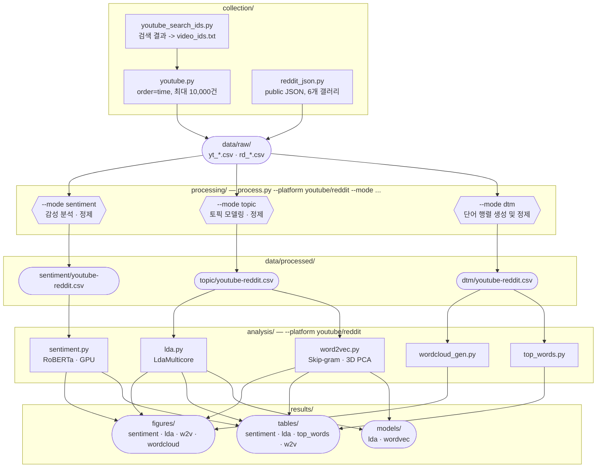

# AI Music Sentiment Analysis

AI 생성 음악에 대한 대중 인식을 분석하는 프로젝트  
YouTube 댓글과 Reddit 데이터를 수집하여 감정 분석, 토픽 모델링(LDA), Word2Vec을 수행합니다.

## Workflow



## Project Structure

```bash
.
├── data/                  # 데이터 저장소
│   ├── raw/               # 원본 데이터 (수집 결과)
│   ├── processed/         # 전처리된 데이터
│   └── collection_summary.json
│
├── src/                   # 소스 코드
│   ├── collection/        # 데이터 수집
│   │   ├── youtube.py
│   │   ├── reddit_json.py
│   │   └── youtube_search_ids.py
│   │
│   ├── processing/        # 데이터 전처리
│   │   ├── youtube.py
│   │   └── reddit.py
│   │
│   ├── analysis/          # 분석 로직
│   │   ├── sentiment.py
│   │   ├── lda.py
│   │   ├── word2vec.py
│   │   ├── wordcloud.py
│   │   └── top_words.py
│   │
│   └── main.py            # 전체 파이프라인 실행
│
├── notebooks/             # 실험용 노트북
├── results/               # 결과물
│   ├── figures/
│   ├── tables/
│   └── models/
│
├── LICENSE
└── README.md
```

## Data Collection

### YouTube

- YouTube API 사용
- 키워드 기반 영상 검색 후 댓글 수집

### Reddit

- Reddit comments json request 사용

## Data Processing

working

## License

This project is licensed under [BSD-3-Clause](LICENSE).
